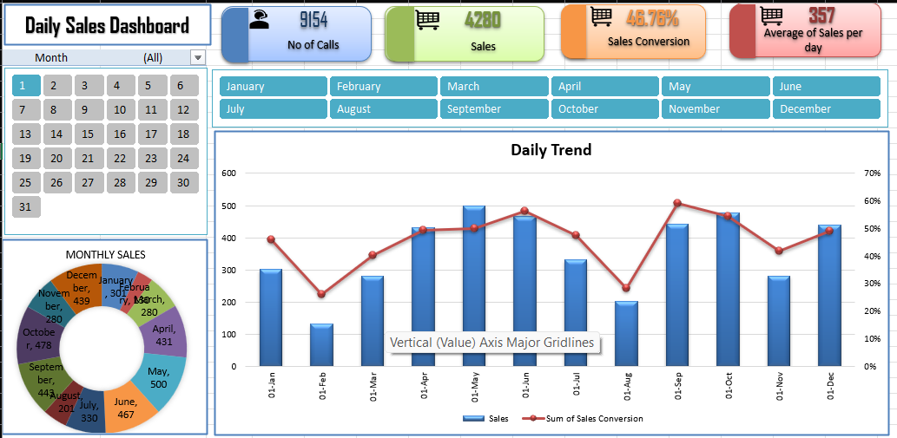

Daily Sales Dashboard

Project Overview
The Daily Sales Dashboard is an interactive Microsoft Excel MIS dashboard designed to analyze daily sales activity and convert operational sales data into meaningful business insights.
The dashboard combines Excel data preparation, formulas, PivotTables, calculated fields, slicers, PivotCharts, KPI cards, and dashboard formatting to provide a clear view of sales performance.
Project Objective
The main objective of this project is to build an interactive sales MIS dashboard that helps users:

## Dashboard Preview

- Monitor daily sales activity
- Track the number of calls and sales
- Calculate sales conversion
- Analyze average sales per day
- Compare daily and monthly sales performance
- Filter data by month and calendar day
- Identify changes in sales performance
- Present important business information in a management-friendly format
  Dataset
  The dataset contains daily sales activity for the year 2026.
  Main fields:
  Column	Description
  Date	Daily transaction/activity date

# of Calls	Number of calls made on a particular day

Sales	Number of sales generated
Calender	Day number extracted from the date
Month	Month name extracted from the date

The Calendar and Month columns are helper columns used for analysis and dashboard filtering.
Excel Functions Used
DAY Function
Used to extract the day number from the Date column.
=DAY(A2)
TEXT Function
Used to extract the month name from the Date column.
=TEXT(A2,"mmmm")
Key Performance Indicators
The dashboard contains four primary KPIs.

1. Total Calls
   Shows the total number of calls made during the selected period.
2. Total Sales
   Shows the total number of sales generated during the selected period.
3. Sales Conversion
   Measures the efficiency of converting calls into sales.
   Formula:
   Sales Conversion = Sales / Calls
   The result is displayed as a percentage.
4. Average Sales Per Day
   Shows the average number of sales generated per day.
   The Sales field is summarized using the Average aggregation in the PivotTable.
   PivotTable Analysis
   PivotTables are created on a support sheet to summarize the source data and provide the calculations required for the dashboard.
   The project uses PivotTables for:

- KPI calculations
- Daily sales analysis
- Daily conversion analysis
- Monthly sales analysis
- Dashboard filtering
- Chart data preparation
  The support sheet acts as the backend analysis layer, while the dashboard acts as the presentation layer.
  Slicers
  Two main slicers are used.
  Month Slicer
  The Month slicer allows the user to select a particular month and analyze the corresponding sales performance.
  Calendar Slicer
  The Calendar slicer allows users to select one or multiple days for detailed daily analysis.
  The Calendar slicer is configured for a multi-column layout to make day selection easier.
  Report Connections
  Slicer Report Connections are used to connect the slicers with the required PivotTables.
  This allows a single filter selection to update multiple dashboard components.
  For example:
  Month Slicer
  |
  v
  Connected PivotTables
  |
  v
  KPIs + Charts
  |
  v
  Dashboard
  Dashboard Visualizations
  Daily Sales Trend
  The daily trend visualization uses a combination chart.
- Sales are represented using columns.
- Sales Conversion is represented using a line.
- Sales Conversion is displayed on a secondary axis.
  The secondary axis is used because Sales and Sales Conversion have different scales and units.
  Monthly Sales Analysis
  Monthly sales are summarized using a month-wise PivotTable and visualized through a pie chart.
  This helps compare the contribution of different months to overall sales.
  Dashboard Design
  The dashboard uses:
- KPI cards
- Shapes
- Icons
- Linked text boxes
- Slicers
- PivotCharts
- Custom formatting
- Consistent alignment
- Clean dashboard layout
  The dashboard is designed to present important information without requiring users to work directly with the backend PivotTables.
  Project Workflow
  The complete workflow followed in this project is:
  Raw Sales Data
  |
  v
  Helper Columns
  |
  v
  PivotTables
  |
  v
  KPI Calculations
  |
  v
  Slicers
  |
  v
  PivotCharts
  |
  v
  Dashboard
  Excel Concepts Demonstrated
  This project demonstrates practical knowledge of:
- Data preparation
- Date functions
- Text functions
- Helper columns
- Excel Tables
- PivotTables
- Value Field Settings
- Calculated Fields
- SUM aggregation
- AVERAGE aggregation
- Percentage calculations
- KPI creation
- Slicers
- Multi-select slicers
- Report Connections
- PivotCharts
- Combo Charts
- Secondary Axis
- Pie Charts
- Dashboard formatting
- Linked text boxes
- Shapes and icons
- Data filtering
- Daily analysis
- Monthly analysis
- MIS reporting
  Business Insights
  The dashboard helps distinguish between sales volume and sales efficiency.
  For example:
- High calls with low sales may indicate poor conversion.
- Low calls with strong conversion may indicate better sales efficiency.
- A sudden fall in daily sales can be investigated using the Calendar slicer.
- Monthly analysis can highlight stronger and weaker sales periods.
- Comparing Calls, Sales, and Conversion provides a more complete view than looking at Sales alone.
  Interview Explanation
  A concise explanation of the project:
  "I created an interactive Daily Sales Dashboard using Microsoft Excel to convert daily sales and call data into an MIS report. I prepared the data using Calendar and Month helper columns, created PivotTables for KPI calculations, and calculated Total Calls, Total Sales, Sales Conversion, and Average Sales Per Day. I then added Month and Calendar slicers connected through Report Connections. For visualization, I created a daily combo chart with Sales as columns and Sales Conversion as a line on a secondary axis, along with a monthly sales chart. The project helped me understand how Excel can be used to transform operational data into an interactive management dashboard."
  Project Structure
  A recommended GitHub repository structure is:
  Daily-Sales-Dashboard/
  |
  |-- README.md
  |-- Daily_Sales_Dashboard.xlsx
  |-- 2026_Daily_Calls_Sales_Data.xlsx
  |-- screenshots/
  |   |-- dashboard.png
  |   |-- daily_trend.png
  |   |-- monthly_sales.png
  |   |-- slicers.png
  |
  |-- documentation/
  |   |-- project_notes.md
  |   |-- interview_questions.md
  Tools Used
- Microsoft Excel
- PivotTables
- PivotCharts
- Excel Slicers
- Excel Formulas
- Dashboard Design
  Skills Demonstrated
  Technical Skills
- Microsoft Excel
- Data Cleaning and Preparation
- PivotTable Analysis
- Data Aggregation
- KPI Development
- Dashboard Development
- Data Visualization
- Interactive Filtering
- MIS Reporting
  Analytical Skills
- Sales Performance Analysis
- Conversion Analysis
- Daily Trend Analysis
- Monthly Trend Analysis
- Business Performance Interpretation
  Why This Project Is Useful for an MIS Role
  This project demonstrates the practical Excel skills commonly required for an MIS-oriented role.
  It shows the ability to:
- Work with operational data
- Prepare and organize data
- Create automated summaries
- Build management reports
- Create KPI-based reporting
- Analyze performance trends
- Build interactive Excel dashboards
- Present information clearly for decision-making
  Future Improvements
  Possible improvements include:
- Adding salesperson-wise analysis
- Adding region-wise analysis
- Adding current month versus previous month comparison
- Adding weekly sales analysis
- Adding quarterly analysis
- Adding Year, Quarter, Month and Day hierarchy
- Adding Power Query for automated data preparation
- Adding Power Pivot/Data Model for larger datasets
- Automating the refresh process
  Project Outcome
  The final dashboard provides a single interactive view of daily and monthly sales performance.
  The project demonstrates the complete MIS reporting process:
  Data Preparation
  |
  v
  Data Analysis
  |
  v
  KPI Calculation
  |
  v
  Interactive Filtering
  |
  v
  Data Visualization
  |
  v
  Management Dashboard

  
  Author
  Digambar Dharak
  
  Project Type
  Excel MIS Dashboard
  
  Domain
  Sales Performance Analysis and Management Information System
